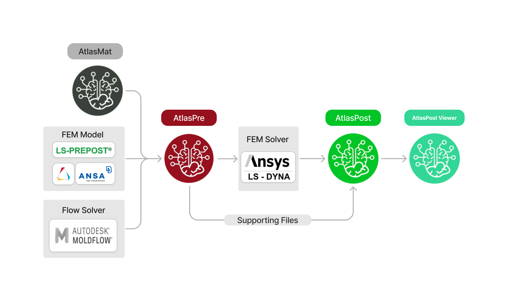
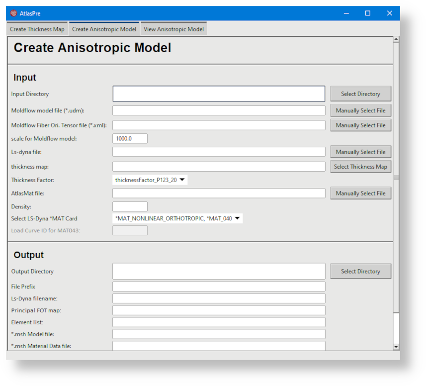
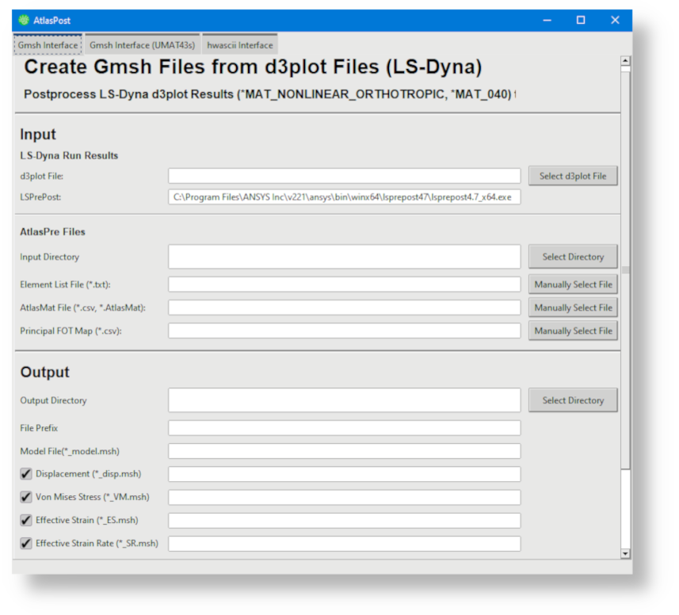

# Airgo Atlas-AI

AirGo’s proprietary *AI-assisted CAE* simulation software, **ATLAS-AI**, provides a collection of tools for manipulating FEM models that have anisotropic material properties, tailored for structures produced with Fiber-Reinforced Thermocomposites (FRTC).

---

## Why use ATLAS-AI?

- **AI and DATA-DRIVEN**: Material property generation based on statistically derived data. No micro-level simulation required. Fiber orientation data is adjusted for accuracy.

- **FAST yet ACCURATE**: No trade-off between speed and accuracy. The Atlas-AI method does not require detailed FEM model. No solver coupling required. 

- **PROPRIETRY FAILURE MODEL**: Atlas-AI includes our proprietary failure criterion which outperforms standard failure models.

- **MATERIAL/SOFTWARE AGNOSTIC**: Atlas-AI solutions can be adapted to multiple FEM software, covering implicit and explicit analysis. Atlas-AI solutions can be applied to all FRTC standards. 

- **THIRD-PARTY VALIDATED**- Blind validation exercises were conducted with Mitsubishi Chemicals Advanced Materials (MCAM) and SAFRAN on two different metal replacement with FRTC material projects, i.e., comparing Atlas-AI vs conventional CAE methods. Atlas-AI performance was closer to actual physical testing data, in comparison to conventional CAE simulation undertaken by MCAM and Safran engineering teams. 

---
## AtlasPre and AtlasPost

AtlasPre and AtlasPost (and AtlasPost-Viewer in extension) provide the standard Pre and Post processing tools for FRTC FEM models.

## AtlasPre

## AtlasPost

