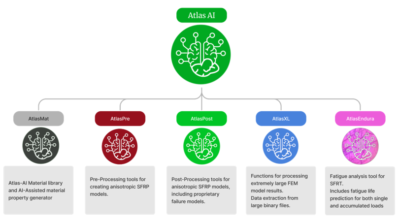

# Airgo Atlas-AI

AirGo’s proprietary *AI-assisted CAE* simulation software, **ATLAS-AI**, provides a collection of tools for manipulating FEM models that have anisotropic material properties, tailored for structures produced with Fiber-Reinforced Thermocomposites (FRTC).

---

## Why use ATLAS-AI?

- **AI and DATA-DRIVEN**: Material property generation based on statistically derived data. No micro-level simulation required. Fiber orientation data is adjusted for accuracy.

- **FAST yet ACCURATE**: No trade-off between speed and accuracy. No solver coupling required. The Atlas-AI method does not require detailed FEM model.  

- **PROPRIETRY FAILURE MODEL**: Atlas-AI includes Airgo's proprietary failure criterion which outperforms standard failure models.

- **MATERIAL/SOFTWARE AGNOSTIC**: Atlas-AI solutions can be adapted to multiple FEM software, covering implicit and explicit analysis. Atlas-AI solutions can be applied to all FRTC standards. 

- **THIRD-PARTY VALIDATED**- Blind validation exercises were conducted with Mitsubishi Chemicals Advanced Materials (MCAM) and SAFRAN on two different FRTC material projects, i.e., comparing Atlas-AI vs conventional CAE methods. Atlas-AI models completed with less time and predictions were closer to actual physical testing data, in comparison to conventional CAE simulation undertaken by MCAM and Safran engineering teams. 

---

##  Where does Atlas-AI fit in?

In the simplest sense, Atlas-AI bridges the divide between manufacturing simulation and structural simulation.

In the bigger picture, Atlas-AI helps engineers reached light-weighting design goals with efficiency, accuracy and minimal computational resources. With Atlas-AI, design iterations can be reduced from weeks (or months) to days.

---
TL;DR? jump to [ATLAS-AI at a Glance](#-atlas-ai-at-a-glance)

### About us
AirGo develops innovative lightweight technologies for demanding applications in various industries. https://www.airgodesign.com/company

### The EV Industry

The demand for battery power, measured in gigawatt-hours, is expected to grow from 185 GWh in 2020 to 2,035 GWh by 2030, representing an 11-fold increase, with nearly 90% of the demand from transportation alone. Lithium-ion is the most dominant rechargeable battery technology, accounting for just over 40% of the global revenue share in 2022, driven mostly by its use in the EV industry.

Over the years, metals have dominated the market for EV battery cases owing to their advantages, such as being extremely robust and impact-resistant, high-temperature tolerance, flame-retardant, and affordable. However, in recent years, the penetration of composite battery cases has been growing at a rapid pace owing to factors such as lighter weight, high production rate, and to a certain extent, higher mechanical performance compared to metals. 

AirGo is looking into composite battery enclosures for the rapidly emerging short/medium-haul electric aircraft market, i.e., a combination of commercial urban air mobility vehicles (UAVs, eVTOLs, etc.) (e.g., E-hang EH216-S, Xpeng AeroHT, etc.) and larger regional/private jets e-aircraft such as COMAC ARJ21, Heart airspace’s ES-30, Energia Electric (E9-FE), etc. This market was valued at $9 billion in 2022, with a 20% CAGR, and has the prospect to reach $67 billion by 2033.

---

## ATLAS-AI at a Glance

---
## AtlasPre and AtlasPost

AtlasPre and AtlasPost (and AtlasPost-Viewer in extension) provide the standard Pre and Post processing tools for FRTC FEM models.

*General workflow*

### AtlasPre

### AtlasPost

AtlasPre and AtlasPost both feature autocompletion to speed up the filename entry.

