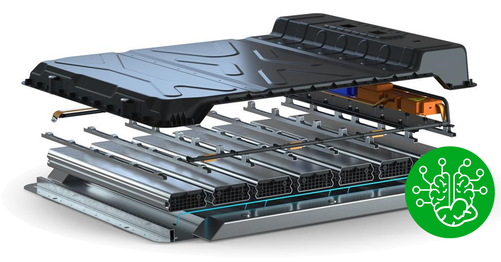

# Airgo Atlas-AI

Atlas-AI software offers you the fastest route to the benefit of  Fiber Reinforced Thermoplastic applications in aerial vehicles 

AirGo helps the EV industry to reach its sustainability targets by replacing metallic components with lightweight Fiber Reinforced Thermoplastic Composite (FRTC). AirGo’s proprietary *AI-assisted CAE* simulation software, **ATLAS-AI**, is providing our engineering team with the competitive advantage to develop  FRTC components with higher accuracy, in a time-efficient manner, using minimum computational resources.

## Why using ATLAS-AI to develop EV batteries and components?

 - **AI and DATA-DRIVEN**: Material property generation based on statistically derived data. No micro-level simulation required. Fiber orientation data is adjusted for accuracy.
 - **FAST yet ACCURATE**: No trade-off between speed and accuracy. The Atlas-AI method does not require detailed FEM model. No solver coupling required. 
 - **PROPRIETRY FAILURE MODEL**: Atlas-AI includes our proprietary failure criterion which outperforms standard failure models.
 - **MATERIAL/SOFTWARE AGNOSTIC**: Atlas-AI solutions can be adapted to multiple FEM software, covering implicit and explicit analysis. Atlas-AI solutions can be applied to all FRTC standards. 
- **THIRD-PARTY VALIDATED**- Blind validation exercises were conducted with Mitsubishi Chemicals Advanced Materials (MCAM) and SAFRAN on two different metal replacement with FRTC material projects, i.e., comparing Atlas-AI vs conventional CAE methods. Atlas-AI performance was closer to actual physical testing data, in comparison to conventional CAE simulation undertaken by MCAM and Safran engineering teams. 

