# AirGo Design Atlas-AI

AirGo Design's ATLAS-AI, a proprietary AI-assisted CAE simulation software, offers a suite of tools for manipulating FEM models with components made of highly anisotropic Fiber-Reinforced Thermoplastic Composites (FRTC).

---

## Unlocking the Potential of Fiber-Reinforced Thermoplastics

The growing demand for sustainable and high-performance engineering polymers has led to the development of injection molded (Short/Long) Fiber Reinforced Thermoplastics (FRT).  FRT represents a vital segment within the development of environmentally sustainable engineering plastics, poised to supplant metals in heavy-duty components, applied in aerospace, automotive, electronics etc.

**Why Replace Metals with Fibre Reinforced Thermoplastic Composites (FRTC)?**

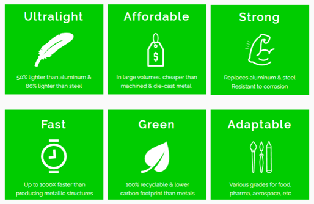

## The Challenge with Designing FRT Heavy-duty Components

Even though this class of reinforced polymers have been utilized in the industry for decades, their full potential has been hindered by conventional CAE simulation methods' inability to accurately simulate their material behavior on components level. This limitation has confined their application primarily to less demanding secondary structures.

The mechanical performance of Fiber Reinforced Thermoplastics components are intricately tied to geometry, material selection, and manufacturing parameters. Unlike its metallic counterparts, Fiber Reinforced Thermoplastics components exhibit strong anisotropy—whereby stiffness and strength are influenced by fiber orientation. Fiber orientation is heavily dependent on a multitude of geometry and manufacturing factors.

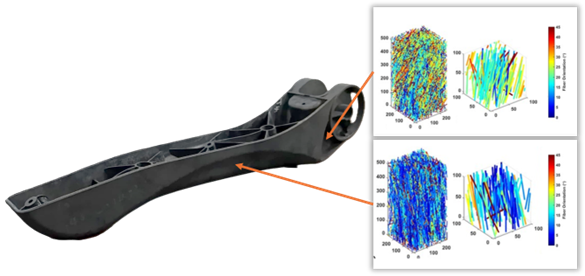

When it comes to simulation, working between micro-scale and macro-scale demands significant time, expertise in various domains, and computing resources. Furthermore, accessing material property data (including material data for the components of the compound, filler etc.) and allowables are not always straightforward, often necessitating costly laboratory testing and specialized knowledge. ATLAS-AI addresses these issues head-on.

---

## Why use ATLAS-AI?

### AI and Data-Driven
Utilizing a statistically derived material property database, micro-level simulation becomes unnecessary. Fiber orientation data is meticulously adjusted based on structure geometry for accuracy.

### Fast Yet Accurate
ATLAS-AI delivers fast results without sacrificing accuracy. It captures multi-layer property variations through the thickness of the part—without requiring high-resolution FEM models. Since it operates entirely in pre- and post-processing, there’s no need for co-simulation or data exchange with external software. This results in:
 - 95% faster load times
 - 90% smaller result files
 - 65% lower RAM usage

### Proprietary Failure Model 
ATLAS-AI incorporates a custom-developed failure criterion that outperforms conventional models by leveraging AI-generated allowables, enabling more accurate and reliable failure prediction.

### Material/Software Agnostic 
ATLAS-AI is fully compatible with a broad range of FEA platforms—supporting both implicit and explicit solvers—and is applicable to all types of fiber-reinforced thermoplastics (FRTs), regardless of chemical composition.

### Third-Party Validated
Blind validation exercises were conducted with Mitsubishi Chemicals Advanced Materials (MCAM) and SAFRAN on two different FRTC material projects, i.e., comparing Atlas-AI vs conventional CAE methods. Atlas-AI models completed with less time and predictions were closer to actual physical testing data, in comparison to conventional CAE simulation undertaken by MCAM and Safran engineering teams.

---

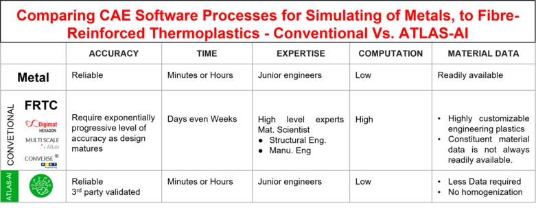

---

## Where does Atlas-AI Fit in?

AirGo Design’s ATLAS-AI suits streamline structural analysis by bridging the gap between injection molding simulations and accurate FEA models.

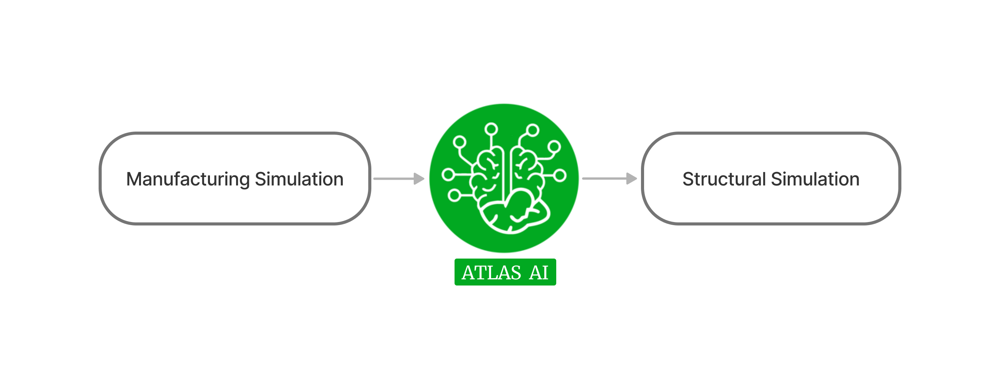

Unlike conventional tools that merely map fiber orientation tensor data to a separate structural mesh, ATLAS-AI intelligently adapts anisotropic material properties based on both geometry and material selection.

---

## ATLAS-AI at a Glance

ATLAS-AI currently consists of 5 main modules:-AtlasMat, AtlasPre, AtlasPost, AtlasXL, and AtlasEndura.

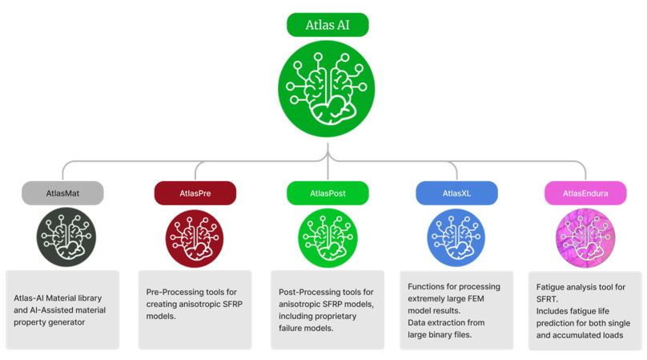

## Workflow

Shown below is an example of how the modules are typically integrated into a FEM analysis. AtlasPre takes the information from the manufacturing simulation and integrates the anisotropic properties to the FEM model. After the simulation, AtlasPost is used to post-process and generate result images.

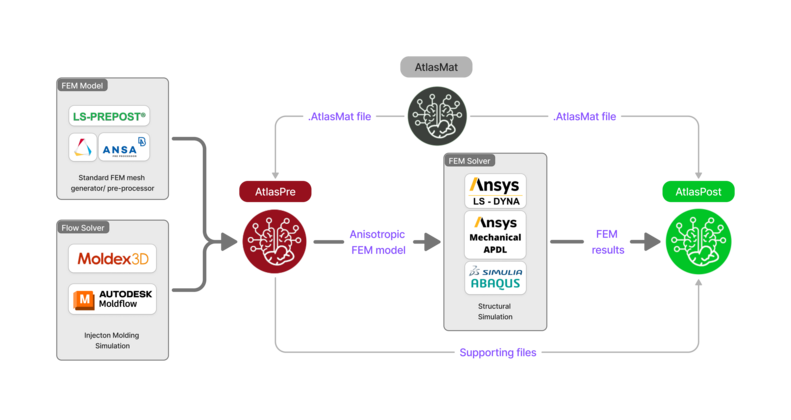

---

## Accuracy with ATLAS-MAT

**ATLAS-MAT** is an internal module (not available for licensing) within the ATLAS-AI suite that uses a pre-trained algorithm based on historical data to generate anisotropic material properties of Fiber Reinforced Thermoplastic Composite (FRTC) that change based on fiber orientation. 

ATLAS-MAT’s Data-Corrected Micromechanics (DCM) has proven to be accurate. Shown below is a comparison of accuracy between Tsai-Hill method and ATLAS-MAT method on predicting 45-degree Tensile strength (S45) and 45-degree stiffness (E45) over a set of 16 different FRTC materials. The ATLAS-MAT prediction showed a significantly lower error percentage over all the grades of FRTC materials. 

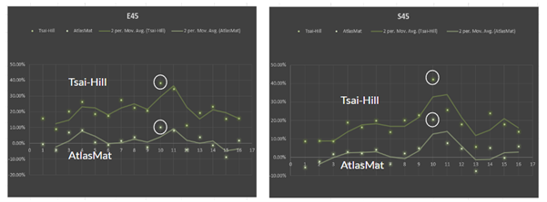

## Part Level Validation 

### Case Study (1) Aircraft Armrest

The ATLAS-AI-integrated FEM models were evaluated on an established AirGo Design’s CARBON aircraft seat armrest  component.  It is noteworthy that ATLAS-AI methodology was originally applied in development of the CARBON seats starting from design/manufacturing of the armrest, which was fabricated and tested according to standard abuse loads. The material grade is of the PEI family with 20% carbon fiber content.

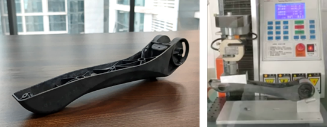

The structural simulations were conducted with Ansys LS-Dyna. To achieve better precision in  simulating the armrest's deformation under load, the FEM model incorporates not only the armrest itself but also the test rig it is secured to.

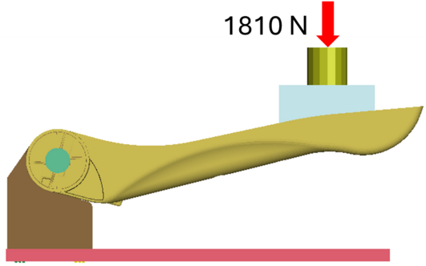

For comparison, the analysis was conducted on three different Armrest model:
1.  Anisotropic armrest LS-Dyna model created using ATLAS-AI integrated with Moldflow
2.	Anisotropic armrest LS-Dyna model created using ATLAS-AI integrated with Moldex3D BLM approach. 
3.	Quasi-isotropic armrest LS-Dyna model, assuming a conventional 70% knockdown factor on the TDS 0-degree stress-strain curve. (i.e. without ATLAS-AI and Moldex3D)

#### Pre-Processing for Anisotropic models

Moldflow and Moldex3D were used to generate Fiber orientation tensor (FOT) data required as input for ATLAS-Pre (ATLAS-AI’s dedicated pre-processor for creating anisotropic FEM models). ATLAS-Pre not only maps the FOT onto the dissimilar structure mesh but also recalibrates the data, factoring in the geometry features and material statistical data, thus ensuring higher simulation accuracy.

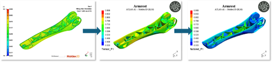

The anisotropic material cards are then defined and assigned according to the modified FOT profile for each element. Material properties for all FOT variations are based on the supplied AtlasMat file. 

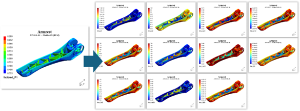

#### Load vs Displacement
Based on the load displacement curves for test and FEM, the ATLAS-AI/Moldflow approach achieved **70%** accuracy whereas ATLAS-AI/Moldex3D approach demonstrated a notable **91.8%** accuracy, outperforming conventional method with 59.2%.

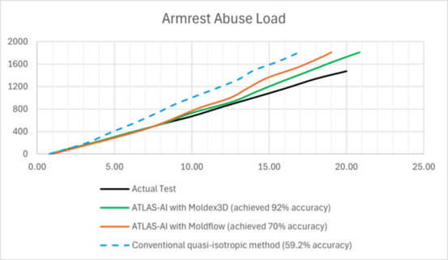

#### Failure Prediction

ATLAS-Post was used to assess ATLAS-AI’s proprietary Y-Failure Criterion and compared with actual part failure. Y-Failure plots show the onset of failure around the inner horizontal rib location. Analysis of test pictures showed strong indications that the failure was likely to have been initiated at the same rib location. 

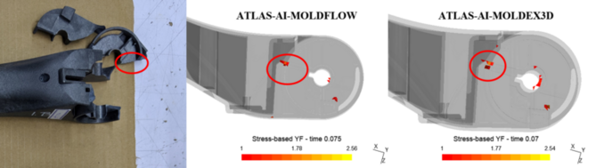

---

### Case Study (2) Pole Extender

ATLAS-AI was also assessed on 60% short glass fiber reinforced Polyarylamide (PARA) pole extender. The component was designed and tested to withstand up to 900N bending load.

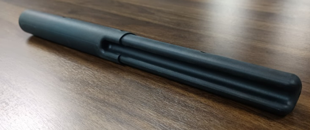

 Figure below shows the component being attached to the test rig in a cantilever position. On the other end of the pole extender, a metal block is attached to distribute the applied load evenly onto the specimen.

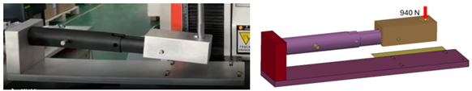

#### Preprocessing and Setup

Similar to the previous case study, the component was also simulated for both anisotropic and conventional quasi-isotropic material methods. The FEM model also includes the test rig to obtain better precision in displacement results.

#### Load vs Displacement

Both ATLAS-AI/Moldflow and ATLAS-AI/Moldex3D anisotropic model achieved accuracies above 90%, compared to the 74.2% conventional method.

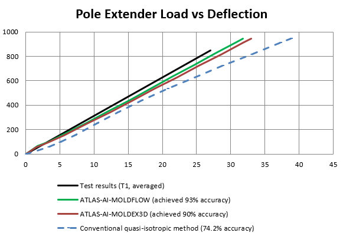

#### Failure Prediction

Atlas-Post was used to assess ATLAS-AI’s proprietary Y-Failure Criterion. The simulation accurately predicted the failure location at the fastener point.

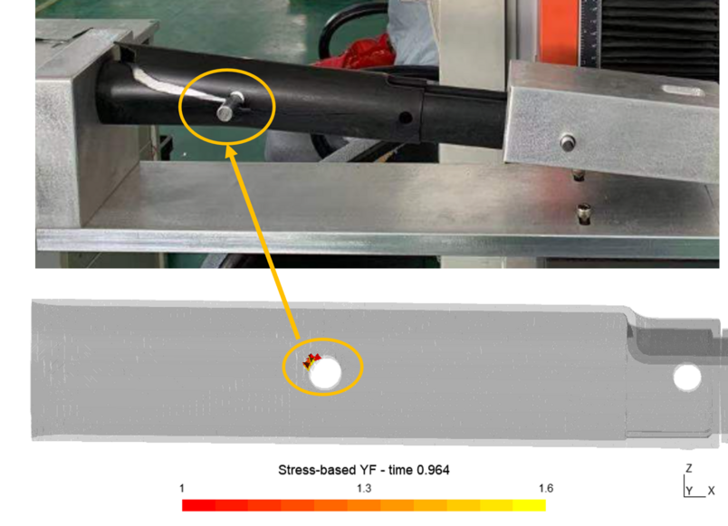

### Key Takeaway
ATLAS-AI was validated over existing FRTC components. 
ATLAS-AI empower engineers with more efficient and accurate simulations, along with (i) lighter models, (ii) quicker run-time, and (iii) increased reliability in simulation results.

## About us
AirGo develops innovative lightweight technologies for demanding applications in various industries. https://www.airgodesign.com/company

---

## Contact Us

For more information or a demo, email to atlas@airgodesign.com