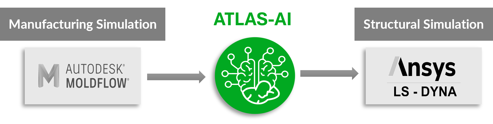
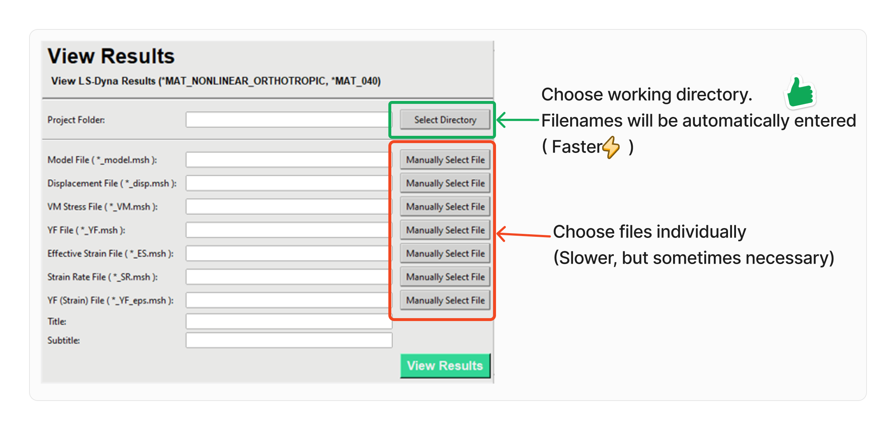

# Airgo Atlas-AI

AirGo’s proprietary *AI-assisted CAE* simulation software, **ATLAS-AI**, provides a collection of tools for manipulating FEM models that have anisotropic material properties, tailored for structures produced with Fiber-Reinforced Thermocomposites (FRTC).

---

## Why use ATLAS-AI?

- **AI and DATA-DRIVEN**: Material property generation based on statistically derived data. No micro-level simulation required. Fiber orientation data is adjusted for accuracy.

- **FAST yet ACCURATE**: No trade-off between speed and accuracy. No solver coupling required. The Atlas-AI method does not require detailed FEM model.  

- **PROPRIETRY FAILURE MODEL**: Atlas-AI includes Airgo's proprietary failure criterion which outperforms standard failure models.

- **MATERIAL/SOFTWARE AGNOSTIC**: Atlas-AI solutions can be adapted to multiple FEM software, covering implicit and explicit analysis. Atlas-AI solutions can be applied to all FRTC standards. 

- **THIRD-PARTY VALIDATED**- Blind validation exercises were conducted with Mitsubishi Chemicals Advanced Materials (MCAM) and SAFRAN on two different FRTC material projects, i.e., comparing Atlas-AI vs conventional CAE methods. Atlas-AI models completed with less time and predictions were closer to actual physical testing data, in comparison to conventional CAE simulation undertaken by MCAM and Safran engineering teams. 

---

##  Where does Atlas-AI fit in?

In the simplest sense, Atlas-AI bridges the divide between manufacturing simulation and structural simulation.

In the bigger picture, Atlas-AI helps engineers reached light-weighting design goals with efficiency, accuracy and minimal computational resources. With Atlas-AI, design iterations can be reduced from weeks (or months) to days.

---

### About us
AirGo develops innovative lightweight technologies for demanding applications in various industries. https://www.airgodesign.com/company

### The EV Industry

The demand for battery power, measured in gigawatt-hours, is expected to grow from 185 GWh in 2020 to 2,035 GWh by 2030, representing an 11-fold increase, with nearly 90% of the demand from transportation alone. Lithium-ion is the most dominant rechargeable battery technology, accounting for just over 40% of the global revenue share in 2022, driven mostly by its use in the EV industry.

Over the years, metals have dominated the market for EV battery cases owing to their advantages, such as being extremely robust and impact-resistant, high-temperature tolerance, flame-retardant, and affordable. However, in recent years, the penetration of composite battery cases has been growing at a rapid pace owing to factors such as lighter weight, high production rate, and to a certain extent, higher mechanical performance compared to metals. 

AirGo is looking into composite battery enclosures for the rapidly emerging short/medium-haul electric aircraft market, i.e., a combination of commercial urban air mobility vehicles (UAVs, eVTOLs, etc.) (e.g., E-hang EH216-S, Xpeng AeroHT, etc.) and larger regional/private jets e-aircraft such as COMAC ARJ21, Heart airspace’s ES-30, Energia Electric (E9-FE), etc. This market was valued at $9 billion in 2022, with a 20% CAGR, and has the prospect to reach $67 billion by 2033.

Atlas-AI provide the necessary tools for the job.

---

## ATLAS-AI at a Glance

## Workflow
Shown below is an example of how the modules are typically integrated into a FEM analysis. AtlasPre takes the information from the manufacturing simulation (Moldflow Analysis) and integrates the anisotropic properties to the FEM model. After the simulation, AtlasPost is used to post-process and generate result files which can then be viewed using AtlasPost_Viewer.

---
## AtlasMat

AtlasMat hosts a material library of up to 30+ SFRT material standards. 
AI and statistics based corrections are preformed based on the inputs (minimal requirement is fiber/matrix tensile modulus and density)

A encrypted table of coefficients is generated to serve as input for AtlasPre and AtlasPost. The coefficients correspond to numerical functions for both static and strain-rate-dependent dynamic material properties.

## AtlasPre
As shown in [Workflow](#-workflow), AtlasPre offers a streamline approach to setup a model with anisotropic material properties (Currently supports LS-Dyna MAT040, LS-Dyna User-Defined Material). 

This process includes:-

- Thickness field mapping (for material field data correction)
- New FEM file creation. 
- Quickcheck of material properties using gmsh as viewer. Include macros for generating images for documentation purposes.

## AtlasPost ( and AtlasPost-Viewer ):

Large FEM output binary files typically contains everything i.e. all element and all results. Conventional post-processing programs will

AtlasPost allows users to downselects to the components of interest and splits the data by result types instead of timesteps. Thus, this gives:-
   - Smaller files for post-processing. (up to **90% smaller**)
   - The choice to create and load only selected results (e.g. displacement, stress, Y-Failure).
   - Faster loading time (up to **90% faster**)

## AtlasXL

AtlasXL is a specialized tool for data extraction from large assemblies with single/ multiple anisotropic parts.

AtlasXL currently supports data extraction from LS-Dyna d3plots and binout files.

## AtlasEndura

AtlasEndura provides the framework for conducting fatigue analysis on SFRT parts. LifeCycle and Failure life are based on Airgo's proprietary fatigue failure criterion.

---

## Other General Features

- Autofill based on naming convention:

    Anisotropic material simulation require working with both reading in and writing out multiple files. 
    To speed up the filename entry process, Atlas-AI provides some basic features to autofill. This feature based on the assumption that the files are named in certain logic or convention

    

    
- Autofill based on working directory and filename extensions.

  Another logic that is built into some modules is that all related input files are placed in the same directory. Given  working directory, the input files are autofilled.

  

## Contact Us

For more information or a demo, email to atlas@airgodesign.com